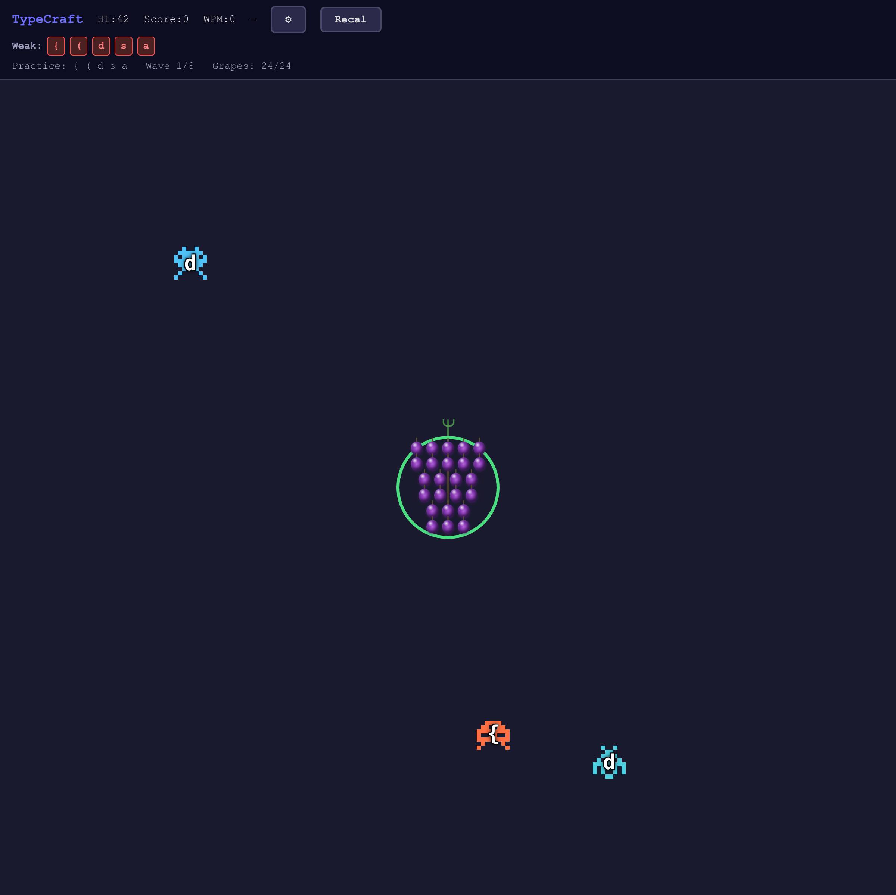
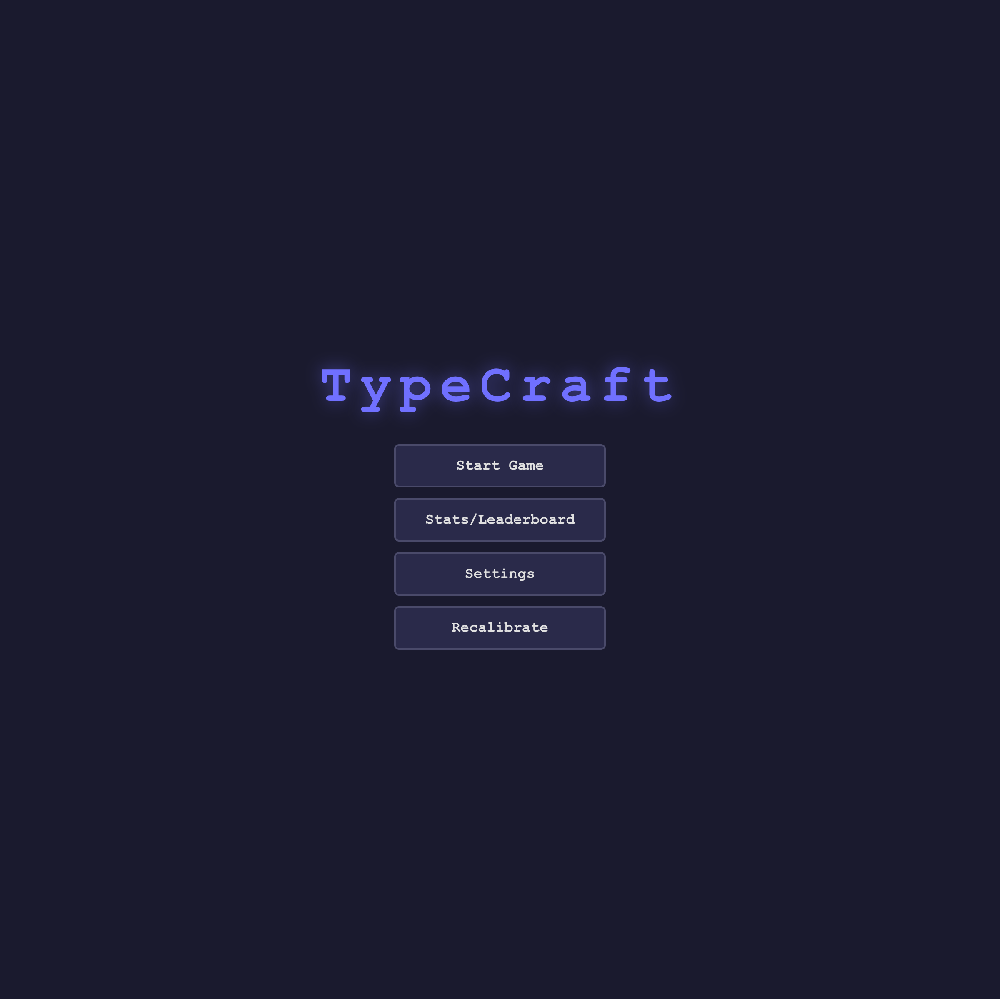
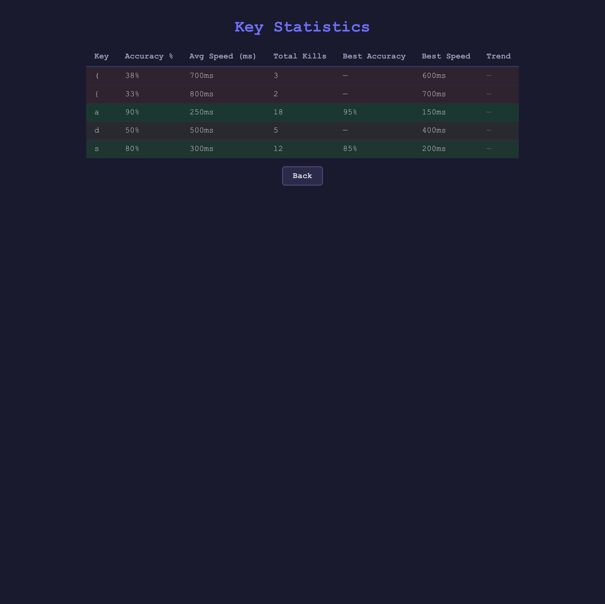

# TypeCraft

A Space Invaders-style typing game where pixel-art invaders approach a grape cluster and you destroy them by typing the matching key. The game identifies your weak keys and drills them with adaptive practice rounds.

**[Play it live at typecraft.hippogriff.io](https://typecraft.hippogriff.io)**



## How It Works

1. **First launch** walks you through a short demo, then 5 calibration rounds (one per key group) to profile your typing weaknesses.
2. **Practice rounds** drill your weakest keys using a 70/30 focus/filler split. Words and code snippets are chosen to contain the characters you need to practice.
3. **Invaders** spawn from screen edges in word-based batches and drift toward the grape cluster at the center. Press the matching key to destroy the nearest one.
4. **Grapes** take damage when invaders reach the cluster. Every 3 absorbed invaders pops a grape. Lose all grapes and the round ends.
5. **Stats** track per-key accuracy, reaction time, trend, and personal bests. Weakness rankings update after every round.

Everything persists in `localStorage` -- close the browser and pick up where you left off.

| Main Menu | Stats Screen |
|:---------:|:------------:|
|  |  |

## Quick Start

```bash
npm install
npm run dev      # http://localhost:5173
```

## Commands

| Command | Description |
|---------|-------------|
| `npm run dev` | Start dev server |
| `npm run build` | TypeScript check + production build |
| `npm test` | Run all unit tests (Vitest) |
| `npm run test:watch` | Tests in watch mode |
| `npm run lint` | ESLint |

## Architecture

The codebase is split into three layers with strict dependency rules: components depend on hooks, hooks depend on lib, lib depends on nothing.

```
src/
  lib/          Pure logic (zero React imports, fully unit-testable)
  hooks/        React hooks that bridge lib logic to the UI
  components/   Presentational components (render state, emit events)
  App.tsx       Wiring: connects hooks, components, and browser events
```

### Pure Logic Layer (`src/lib/`)

Every function takes state in and returns new state. No side effects, no React, no DOM.

| Module | Purpose |
|--------|---------|
| `game-engine.ts` | Invader creation, movement, collision detection, keypress handling |
| `wave-generator.ts` | Character selection for waves, calibration round configs |
| `scoring.ts` | Key profiles, weakness scoring, trend calculation |
| `stats.ts` | WPM calculation, learning speed tracking |
| `storage.ts` | localStorage persistence with schema versioning |
| `settings.ts` | Settings validation and defaults |
| `adaptive-calibration.ts` | Rolling accuracy tracker for calibration speed adjustment |
| `accuracy-ring.ts` | Hit/miss ring state around grape cluster |
| `sprites.ts` | Pixel-art sprite templates and color palettes |
| `keys.ts` | Key group definitions |
| `word-list.ts` | Word/snippet selection for invader batches |

### Hooks Layer (`src/hooks/`)

| Hook | Purpose |
|------|---------|
| `useGameLoop` | `requestAnimationFrame` bridge. Ticks invader movement, detects collisions, handles keypresses. All game physics live here. |
| `useGameState` | App-level state machine. Manages screen transitions, round setup, persistence, calibration flow. |

### Component Layer (`src/components/`)

Stateless rendering. Each component receives props and renders DOM. No game logic.

`GameBoard` | `HUD` | `RoundSummary` | `RoundEnd` | `Countdown` | `MainMenu` | `PauseMenu` | `SettingsScreen` | `StatsScreen` | `OnboardingDemo`

## State Management

There is no state library. Two hooks own all state:

```
                         +-----------------+
                         |   useGameState  |
                         |  (app state)    |
                         +--------+--------+
                                  |
                    reads/writes localStorage
                                  |
              +-------------------+-------------------+
              |                                       |
    +---------v---------+                   +---------v---------+
    |  Screen / Mode    |                   |  Key Profiles     |
    |  (menu, playing,  |                   |  Weakness Ranks   |
    |   calibration,    |                   |  Round History    |
    |   stats, etc.)    |                   |  Settings         |
    +-------------------+                   +-------------------+

                         +-----------------+
                         |   useGameLoop   |
                         |  (frame state)  |
                         +--------+--------+
                                  |
                    requestAnimationFrame tick
                                  |
              +-------------------+-------------------+
              |                   |                   |
    +---------v-----+   +---------v-----+   +---------v-----+
    | Invader        |  | Collision     |  | Wave           |
    | positions      |  | detection     |  | advancement    |
    | (via refs)     |  | (grape loss)  |  | (auto-spawn)   |
    +----------------+  +---------------+  +----------------+
```

**`useGameState`** owns persistent state: key profiles, round history, settings, screen transitions, calibration progress. It reads from `localStorage` on mount and writes on every change.

**`useGameLoop`** owns frame-level state: invader positions, pending spawns, collision checks. It runs a `requestAnimationFrame` loop and stores positions in refs to avoid triggering React re-renders on every frame. It calls back into `useGameState` (via `onRoundEnd`, `onStateChange`) when the round completes or state needs to be persisted.

**`App.tsx`** connects both hooks to the DOM: it registers the global `keydown` listener, passes props between hooks and components, and manages transient UI state (explosions, grape bursts, countdowns).

## Testing

- **293 unit tests** across 24 test files (Vitest + jsdom + React Testing Library)
- **20 E2E tests** (Playwright + Chromium) covering all critical user flows
- Game engine functions are pure and fully testable without any DOM or React

```bash
npm test                                    # all unit tests
npm test -- src/__tests__/game-engine.test.ts  # single file
npx playwright test                         # E2E tests
```

## Tech Stack

React 19, TypeScript (strict mode), Vite, Vitest, Playwright, localStorage. No backend. No state library. No CSS framework.
